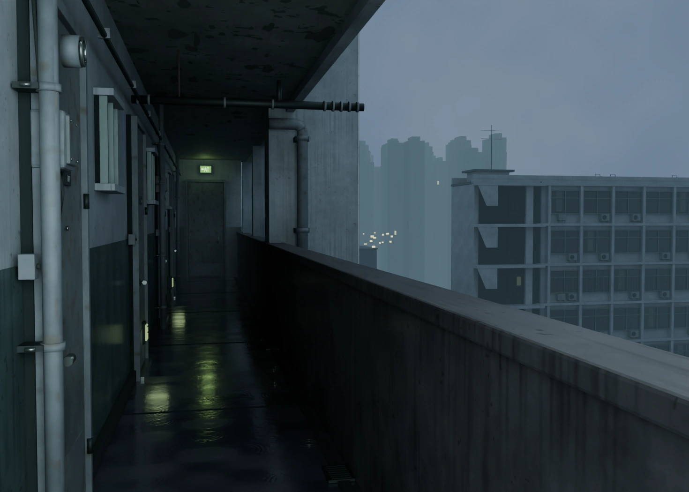

# Rain Gallery — дождливая галерея

Редактируемая 3D-реконструкция галереи жилого дома по одному изображению: мокрый бетон, двери, трубы, зелёный указатель выхода, соседний дом, дальний город и дождь.

Это **интерпретация, а не пиксельно точная копия фотографии**. Перспектива и видимые формы подобраны по референсу; метрический масштаб, скрытые поверхности и план города предполагаются. Фотография не используется как фон камеры или текстура, подменяющая геометрию.



## Что открыть

**[Скачать весь готовый проект ZIP](https://github.com/ioanns2002-star/Test/archive/refs/tags/rain-gallery-v1.zip)** · [Страница релиза](https://github.com/ioanns2002-star/Test/releases/tag/rain-gallery-v1)

| Файл | Как использовать |
| --- | --- |
| [rain-gallery.blend](public/downloads/rain-gallery.blend) | Открыть в **Blender 4.5 LTS**. Все текстуры упакованы внутрь. |
| [gallery-offline.html](public/downloads/gallery-offline.html) | Скачать файл и открыть двойным щелчком в современном браузере с WebGL 2. Сервер и интернет для просмотра сцены не нужны. |
| [godot-gallery.zip](public/downloads/godot-gallery.zip) | Распаковать, импортировать `project.godot` в **Godot 4.4+**, нажать `F5`. Проверено в 4.4.1. |
| [rain-gallery.glb](public/assets/rain-gallery.glb) | Самодостаточная glTF-модель для импорта в другие 3D-программы и движки. |

В GitHub используйте **Download raw file** на странице выбранного файла. Полный ZIP релиза содержит готовые файлы, исходники и инструкции. Размеры и SHA-256 файлов записаны в [каталоге артефактов](public/assets/artifact-manifest.json).

### Blender

- `NumPad 0` — исходная камера `Camera_Reference`; `F12` — Cycles-рендер.
- `Space` — воспроизведение нативной системы дождя, кадры 1–180.
- Дополнительные камеры: `Camera_CorridorDetail`, `Camera_CityOverview`, `Camera_Reverse`.
- Архитектура, детали галереи, вода, соседний дом, город, дождь и камеры разделены на коллекции.
- Исходный `.blend` содержит отдельные редактируемые объекты. GLB сгруппирован по материалам для быстрого просмотра; он не заменяет исходник.
- Финальный рендер: 1470 × 1050, Cycles, 160 samples, denoising. На CPU рендер может занять несколько минут; готовое изображение уже приложено.

### Браузер

Орбита — перетаскивание и колесо мыши. Прогулка — `WASD` и перетаскивание для обзора. «Сбросить вид» возвращает положение и вертикальный угол обзора камеры. Пропорции исходного кадра — **1,4:1**; при другом размере окна горизонтальная композиция меняется.

Можно переключать дождь, анимацию и свечение, менять экспозицию, сохранять PNG и открывать сравнение с референсом. Надпись **REALTIME · GLB** означает настоящий интерактивный 3D-вид. Если WebGL недоступен, интерфейс явно показывает **статический** рендер вместо него.

Офлайн-HTML содержит код, модель, референс и рендер. Скачивание GLB и изображения из него также локальное. Ссылки на отдельный `.blend` и Godot ZIP ведут в GitHub и требуют интернета.

### Godot

Кнопка «Войти в сцену» захватывает мышь. `WASD`/стрелки — движение, мышь — обзор, `Shift` — быстрее, `R` — вернуть камеру, `T` — дождь, `Esc` — освободить курсор, `F1` — подсказка. Подробности: [docs/GODOT.md](docs/GODOT.md).

Свет, отражения, туман и частицы в Three.js/Godot адаптированы для реального времени и **не совпадают с трассировкой Cycles**. Освещение не запечено в фотографическую плоскость.

## Дополнительные ракурсы

[Вглубь галереи](public/assets/detail.webp) · [Соседний дом и город](public/assets/city.webp) · [Обратный вид](public/assets/reverse.webp) · [Референс рядом с рендером](public/assets/comparison.webp)

## Запуск исходников

Для веб-просмотра достаточно Node.js **22.12+** и npm:

```bash
npm ci
npm run dev
```

Для генерации сцены дополнительно нужны Blender 4.5 LTS, Python 3.11+, NumPy и Pillow. На Debian/Ubuntu от root `bash scripts/setup.sh` устанавливает зависимости и официальную Linux x64 сборку Blender с проверкой SHA-256. На другой системе установите Blender и Python-зависимости обычным способом.

Полная пересборка, включая дополнительные ракурсы, офлайн-HTML и Godot ZIP:

```bash
bash scripts/build_all.sh
```

Можно задать `BLENDER_BIN=/path/to/blender`, `BLENDER_THREADS=4`, `QUALITY=draft|preview|final`. Значение по умолчанию — `final`. Скрипт выполняет этапы последовательно; CPU-рендер всех камер может быть долгим. [Генератор сцены](scripts/build_scene.py) и [генератор детерминированных PBR-текстур](scripts/make_textures.py) входят в проект.

## Проверки

```bash
npm test
npm run validate:model
npm run verify:artifacts
npm run build
```

- Khronos glTF Validator проверяет экспорт, включая вложенные изображения и буферы.
- `verify:artifacts` проверяет форматы, контрольные суммы и согласованность GLB, Godot ZIP и офлайн-ресурсов.
- [Blender-отчёт](docs/blender-verification.json) получен открытием сохранённого `.blend` в отдельном процессе: проверяются текстуры, UV, геометрия, камера и система частиц.
- CI проверяет веб-тесты, glTF и готовые файлы; тяжёлый Cycles-рендер в CI не запускается.

При пересборке отдельных артефактов обновите каталог командой `npm run build:catalog`.
Обычная проверка его не переписывает и отклоняет устаревшие SHA-256, HTML и ZIP.

Материалы и PBR-карты созданы процедурно для этой сцены; сторонних пакетов ассетов и CDN нет. Исходное изображение предоставлено пользователем; отдельная открытая лицензия на фотографию не заявляется.
